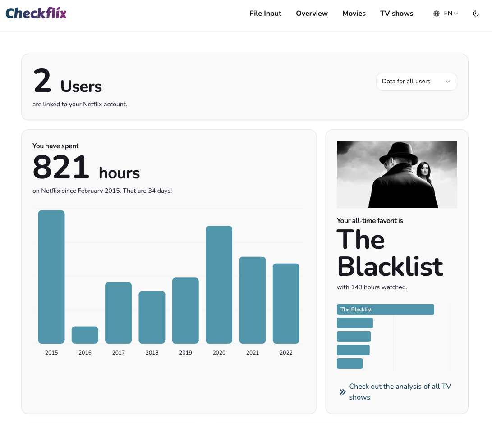

# Checkflix

[Checkflix](https://checkflix.io) is a **web app** to analyze the users viewing activities on Netflix. The basis for this is the data Netflix provides as a downloadable file, when the user requests her or his personal data. All calculations by Checkflix are done **client-side**, which means no user data is uploaded into a cloud. The app reveals which movies and TV shows the user has watched on Netflix, which genres she or he likes and how much time she or he spends on the streaming platform - e.g. how many hours in a given year, month or weekday. Posters of movies and TV shows, as well as summaries and genre categorizations are provided by ["The Movie Database" (TMDB)](https://www.themoviedb.org/). Checkflix is available in German and English.

## Screenshots

Start page:

Dashboard:

TV shows:

## Video Demo
*Note: The video demo was made for the first version of Checkflix. Since then I updated the project structure and the UI.*

## Technologies

Checkflix is built with the javascript front-end-library [_React_](https://react.dev/) within the framework [_Next.js_](https://nextjs.org/) (Version 15, App Router). Typescript is used for type safety and a better dev experience. For styling the CSS framework [_Tailwind_](https://tailwindcss.com/) was used. As typical in React projects I added several external packages / modules, most importantly:

- [_Shadcn_](https://ui.shadcn.com/) for ui components and charts
- [_Nivo_](https://nivo.rocks/) for charts
- [_Swiper_](https://swiperjs.com/) for Carousels
- [_JSZip_](https://www.npmjs.com/package/jszip) to extract zip archives
- [_Papaparse_](https://www.papaparse.com/) to parse CSV files
- [_IDB Keyval_](https://www.npmjs.com/package/idb-keyval) for storing data in indexedDB in the browser
- [_Next-intl_](https://next-intl.dev/) for internationalization

### Discarded

While building the app I tried a lot of different tools and technologies - and discarded a lot them in the process. A few examples:

- Feeling comfortable in SQL lite I was looking for something similar that could run server-less. I found an open-source query and transformation language called [_Jsonata_](https://jsonata.org/) which seemed promising. I discarded it because the queries where way too slow and decided to use vanilla Javascript instead for all calculations.
- Design-wise I started with [_Bootstrap_](https://getbootstrap.com/). Though it was easy to use I got the impression that it is bloated and hard to customize. As an alternative I now use Tailwind CSS, which makes CSS easy to use with class names right in the JSX-elements. I also added some libraries like _Slider_ oder _Headless UI_ to replace more complex Bootstrap components that require some javascript magic and that I didn't want to build from scratch.
- When searching for a way to store data on the device of the user _Session Storage_ in the browser seemed to work well. During testing I noticed that with large datasets it did not work on mobile devices due to size limits the mobile browser sets. I learned that _IndexedDB_ is an alternative, but by default it is not easy to use. I am grateful that I found _IDB Keyval_, which makes IndexedDB to be used in a similar way as session storage.

## Installation

In case you want to run Checkflix locally, you could do this:

1.  Clone github repository
2.  Edit "env.example" and rename to ".env"
3.  Install libraries:

         npm install

4.  Run App

         npm run dev

## Project structure

As true for any Next.js application, most of the files in main folder are boilerplate. While images and logos are stored in the "public"-folder, the magic happens in the "src"-Folder. In this section I describe the purpose of files and subfolders.

### Files in "src"-folder

- **middleware.ts:** Middleware to redirect users to the pages in the right language.

### Subfolder "app/[locale]"

The folder names represent routes. By default only the routes "/" (home)" and "/upload" can be accessed, all other pages are only visible after the user submitted his Netflix-file or decided to try the app witha test data set. Components only used for a specific route are included in subfolders named "\_components".

- **page.tsx**: Welcome screen, tutorial
- **layout.tsx**: Root layout for all pages, loads "Providers" to share settings / data across routes. Sets Metadata.
- **error.tsx**: Error page
- **not-found.tsx**: 404 page
- **privacy**: Privacy policy, lists all services and cookies related to personal data
- **upload**: Page where the user submits the file requested from Netflix (or decides to try a dummy dataset)
- **dashboard**: This page renders multiple chart related to the Netflix usage, e.g. usage per year / month / calender day / weekday; number of tv shows and movies watched and their genres, Top-TV-Shows. The calculations can be filtered by user if the Netflix account contains different user profiles.
- **movies**: Displays all movies the user has been watched with poster image, title, watch-date, genres and summary in a card view, alphabetical order. Can be filtered by genre and Netflix user profile.
- **series**: Displays all TV shows the user has been watched. The Top 10 shows are rendered in a carousel with image, title, years of watching and and total watch-time. All other shows will be displayed below in a card view similiar as on the movie page. The cards can be filtered by genre and user profile.
- **contact**: Contact form. Uses Nodemailer to send emails, configuration in .env file.
- **[..rest]**: Catch-all for error handling

### Subfolder "actions"

This folder contains ther main functions related to data analysis, enrichment and filtering.

- **parseData.ts**: Processes the uploaded file: If it is a zip-archive, the relevant CSV-file is extracted. The CSV-File is parsed and cleaned.
- **enrichData.ts**: Makes API call to TMBD to fetch poster-url, summary and genre of movie or TV show items.
- **seperateDAta.ts**: Seperates movies from tv shows. This is a bit tricky as Netflix does not indicate in the raw data if a watched item is a tv show or a movie.

### Subfolder "hooks"

This folder contains custom hooks used in different parts of the app.

- **useStorage.ts**: Loads data from indexedDB (storage in browser).
- **use-cookie-consent.ts**: Not needed in this version, but can be used to load services only after a user consent.

### Subfolder "context"

This folder contains context provivders used to share data in the whole app.

- **DataProvider**: Shares the states for selected Years (used in the charts), the selected user and a state that indicates if data has been uploaded to Checkflix. This state is used to hide pages that need this data (namely the pages "movies", "series", "dashboard")
- **ThemeProvider**: Stores the user preference for a dark or light theme.

### Subfolder "i18n"

Contains the settings and logic for internationalization.

### Subfolder "types"

Contains type definitions used in the app.

### Subfolder "utils"

Reusable helper functions used in differnt parts of the app.

### Subfolder "lib/dummydata"

To enable users that do not have a Netflix account to try the app I created a test dataset. The JSON-files represent objects that are are loaded into Indexed DB and would have been created from a CSV file in regular usage. I decided to provide these files instead of a dummy csv-file to reduce the number of server requests to TMDB.

### Subfolder "component"

Contains reusable components, sorted in subfolders.

### Subfolder "component/charts"

Contains the charts shown in the dashboard. Most charts are built with Shadcn, which uses Recharts under the hood.

- **CalenderCard.tsx** : Renders a Github-style-calendar chart with small boxes for each day of a given year, hover will reveal viewing time in minutes for that day.
- **GenreCard.tsx**: Renders a pie chart with genre tags for the movies or TV shows the user has watched.
- **MonthCard.tsx**: Renders a chart with watch-times for each month in a selected year.
- **TopSeriesCard.tsx**: Shows the most viewed TV show with an image as well as a bar chart with the top 5 shows.
- **WeekdaysCard.tsx**: Renders an area chart with watch-times on weekdays, can be filtered by year.
- **YearsCard.tsx**: Renders a bar chart with watch-times summed up by years.

### Subfolder "component/cookies"

Files related to consent management. Most of the files are not used in this version of the app as I have not included services that require a user consent. As this might change in the future, I decided to keep the files in the project folder.

- **CookieBannerButton.tsx**: Button to open consent settings (not used)
- **CookieBannerInit.tsx**: Can be called from root layout to render the consent banner on first visit (not used)
- **CookieConsentBanner.tsx**: Modal that allows users to give their consenst to single services (not used)
- **CookieDetails.tsx**: Renders details about services used and how they process personal data (displayed in the Consent Banner and in Privacy Policy)

### Subfolder "component/layouts"

Layout-related components

- **MoviesOrSeriesGrid.tsx**: Renders a responsive grid to display movies or tv shows.
- **TmdbImage.tsx**: Renders an image from the TMDB API or a placeholder if no image is available.
- **TopTenSlider.tsx**: Renders a swiper carousel with the top 10 tv shows.
- **UserCard.tsx**: Renders a card with a summary of the total number of users and a select to switch between users.#

### Subfolder "component/navigation"

All components related to the Navbar and footer

- **LocaleSwitcher.tsx**: Renders a language switcher with flags and language name.
- **Navbar.tsx**: Responsive navbar
- **NavigationLink.tsx**: Render navigation links, active link is underlined
- **ThemeSwitcher.tsx**: Theme switcher component to toggle between light and dark theme
- **Footer.tsx**: Footer component with links to imprint and privacy policy.

### Subfolder "component/selects"

Components to select a specific genre, year or user (all used for data filtering)

### Subfolder "component/ui"

UI components, mainly from Shadcn.

- **cleanAndSortData.js**: Functions to clean and sort raw data provided by Netflix. Will create indexedDB-entries for for TV shows, movies, all watched items and a list of user profiles detected in the Netflix account. Functions are called by the Preloader and Upload pages.
- **fetchGenre.js**: API call to TMDB to fetch genre lists for movies / TV shows that are in TMDB database.
- **getUserlist.js**: loads list of users (in Netflix account) from session storage in browser.
- **toggleGenre.js**: Function that manipulates cards view: If the user selects a specific genre, only movies / TV shows of that genre are shown.

### Subfolder "config"

Configuration files for Consent components and emails.

## Localization

The website is in two languages: German and English. For hard-coded translations an drouting [Next Intl](https://next-intl-docs.vercel.app/) is used. English is the default. You can switch the language via the Locale Switcher in the Navbar:

- http://base-url/ and http://base-url/en should show the english version of start page, http://base-url/de the German Version
- same applies to routes, eg: http://base-url/dashboard will show the dashboard page in English, German version: http://base-url/de/dashboard
- configuration for locale routing is in folder `/scr/i18n`
- all hard-coded translations are in folder `/messages`
- VS Code extension i18n Ally is strongly recommended to facilitate translations

## Limitations

For testing I convinced some friends to give me their Netflix data. However it is likely that there are compositions in the Netflix data not covered by the app. Most of the data sets used for testing are from German accounts. The few data sets from other countries seemed to work fine, however it is possible that the data structure in some countries differs from the ones in my test data sets. In this cases the app will most likely not work. 
